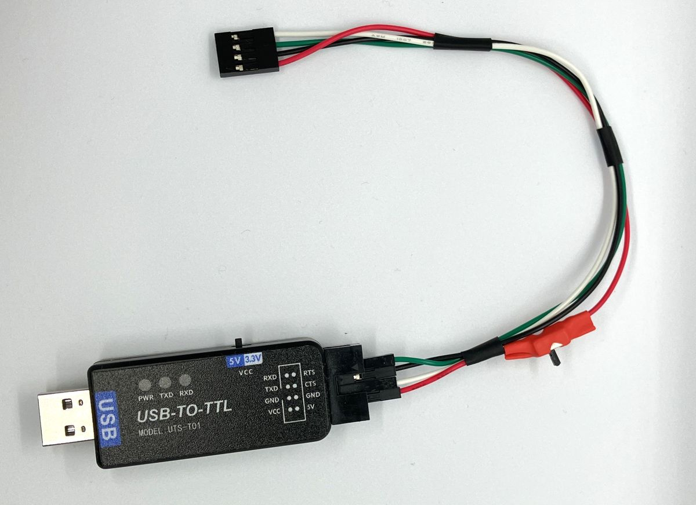

# STC DIY Clock Kit firmware (and a bit of hardware!)

Firmware replacement for STC15 MCU-based DIY Clock Kit available on banggood, aliexpress, etc. Uses [sdcc](http://sdcc.sf.net) to build and [stcgal](https://github.com/grigorig/stcgal) to flash firmware on to `STC15W408AS` series microcontroller.


<p align="center" width="100%">
<br>
<br>

</p>

## Intro

This repo is forked from [https://github.com/zerog2k/stc_diyclock](https://github.com/zerog2k/stc_diyclock), which has been archived.

### Acknowledgments
- [zerog2k](https://github.com/zerog2k) - for the alternative STC DIY Clock firmware and for maintaining the original repo for 6 years
- [venustrg](https://github.com/venustrg) - for implementing synchronization with NMEA devices

### Hardware versions

> There are multiple revisions/versions of this DIY kit. The version I have is based on the `STC15W408AS` microcontroller, it doesn't have the 3rd button and the music chip (the documentation is here: [1](docs/manuals/Manual_STC15W408AS-no-music-chip-1.jpg), [2](docs/manuals/Manual_STC15W408AS-no-music-chip-1.jpg)). 
> 
> I made some changes both in hardware and firmware ([6 digit (HH:MM:SS) version](docs/6-digit/6-digit.md)) and I only tested them with the kit version mentioned above. If your version is different from mine, please consider using the original repo instead.

## Changelog
### December 2024:
 - Updated ESP8266 script for NTP synchronization
 - Improved documentation
 - Minor fixes/improvements
  
### November 2024:

- Added support for the [6-digit (HH:MM:SS)](docs/6-digit/6-digit.md) version
- Updated documentation
- The firmware was tested for both 4-digit and 6-digit version

### October 2024:

- Improved auto-dimming logic
- Fixed compilation errors and improved code style
- Some changes in screens and button functions (according to my personal preferences)

## Features
* time display/set (12/24 hour modes)
* date display/set (with reversible MM/YY, YY/MM display)
* day of week
* year
* seconds display/reset
* display auto-dim
* temperature display in C or F (with user-defined offset adjustment)
* alarm with snooze
* hourly chime
* [Time synchronization](docs/nmea/NMEA.md) via GPS or NTP protocol
* [6 digit (HH:MM:SS) version](docs/6-digit/6-digit.md) support

## Hardware

* DIY LED Clock kit, based on `STC15W408AS` and `DS1302`
* Connected to PC via cheap USB-UART adapter, e.g. CP2102, CH340G

  

## Connection
| P1 header | UART adapter |
|-----------|--------------|
| P3.1      | RXD          |
| P3.0      | TXD          |
| GND       | GND          |
| 5V        | 5V           |

## Requirements
* linux or mac (windows untested, but should work)
* sdcc installed and in the path (recommend sdcc >= 3.5.0)
* stcgal (or optionally stc-isp). Note you can either do `git clone --recursive ...` when you check this repo out, or do `git submodule update --init --recursive` in order to fetch stcgal.

## Usage

```
make clean
make
make flash
```

> When calling `make` without arguments, the firmware is built for the 4-digit version and without NMEA support.

Other options:

* 6-digit version with NMEA support
```
make GREEN6=1 NMEA=1
```

* 6-digit version without NMEA support
```
make GREEN6=1 NMEA=0
```

* 4-digit version with NMEA support
```
make GREEN4=1 NMEA=1
```

### makefile options
* serial port:
`STCGALPORT=/dev/ttyUSB0`

* other options:
`STCGALOPTS="-l 9600 -b 9600"`

* flashing STC15W408AS:
`STCGALPROT="stc15"`

## Use STC-ISP flash tool
Instead of stcgal, you could alternatively use the official stc-isp tool, e.g stc-isp-15xx-v6.85I.exe, to flash.
A windows app, but also works fine for me under mac and linux with wine.

~**note** due to optimizations that make use of "eeprom" section for holding lookup tables, if you are using 4k flash model mcu AND if using stc-isp tool, you must flash main.hex (as code file) and eeprom.hex (as eeprom file). (Ignore stc-isp warning about exceeding space when loading code file.)~ (not really needed anymore as current build is within 4k code)
To generate eeprom.hex, run:
```
make eeprom
```

## Clock assumptions
For STC15F204EA, some of the code assumes 11.0592 MHz internal RC system clock (set by stc-isp or stcgal).
For example, delay routines might need to be adjusted if this is different. (Most timing has been moved to hardware timers.)

## Disclaimers
This code is provided as-is, with NO guarantees or liabilities.
As the original firmware loaded on an STC MCU cannot be downloaded or backed up, it cannot be restored. If you are not comfortable with experimenting, I suggest obtaining another blank STC MCU and using this to test, so that you can move back to original firmware, if desired.

## Diagrams
- [New firmware operation flow  (4 digit)](docs/4-digit-clock-operational-flow.png)
- [Original firmware operation flow](docs/operation_flow_original.png)

## References
http://www.stcmcu.com (mostly in Chinese)

stc15f204ea english datasheet:
http://www.stcmcu.com/datasheet/stc/stc-ad-pdf/stc15f204ea-series-english.pdf

stc15w408as english datasheet:
http://www.stcmicro.com/datasheet/STC15F2K60S2-en2.pdf

sdcc user guide:
http://sdcc.sourceforge.net/doc/sdccman.pdf

some examples with NRF24L01+ board:
http://jjmz.free.fr/?tag=stc15l204

Maxim DS1302 datasheet:
http://datasheets.maximintegrated.com/en/ds/DS1302.pdf

VE3LNY's adaptation of this hardware to AVR (he has some interesting AVR projects there):
http://www.qsl.net/v/ve3lny/travel_clock.html
